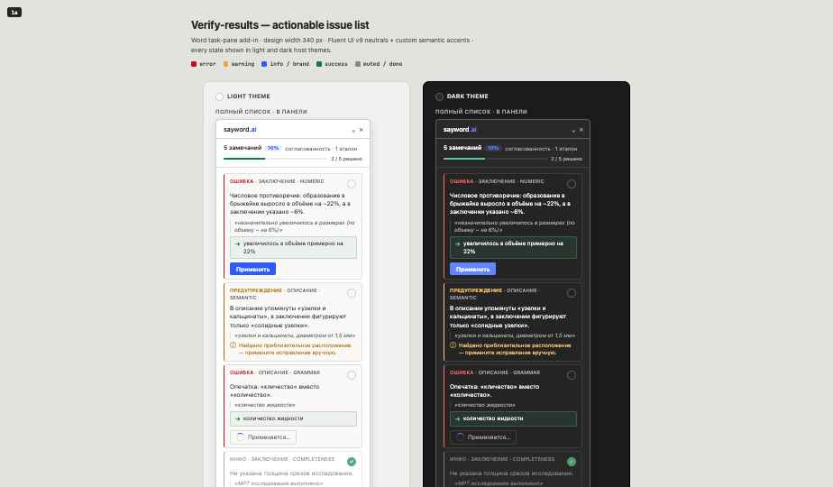

# Надстройка для Word — новые функции: правки в один клик, тёмная тема, русский интерфейс

**2026-07-21**

Обновление надстройки sayword.ai для Word: проверка заключения теперь позволяет
исправлять замечания прямо в панели, а сама панель стала гораздо более «родной»
частью Word — вместо чужеродной вставки сбоку.

  <iframe src="https://www.youtube.com/embed/6nMvE95TbQg" title="sayword.ai Word add-in — feature drop"
    style="position:absolute;top:0;left:0;width:100%;height:100%;border:0;"
    allow="accelerometer; autoplay; clipboard-write; encrypted-media; gyroscope; picture-in-picture"
    allowfullscreen></iframe>

## Что нового

- **Правки в один клик при проверке заключения.** Если для замечания есть предложенное
  исправление, рядом появляется кнопка **Применить** — она заменяет отмеченный текст на
  предложенный вариант, выделяет его и помечает строку как выполненную. В шапке панели
  теперь отображается прогресс: `N / M решено`, а каждую строку можно отметить выполненной
  вручную. Поиск отмеченного места в тексте стал многоступенчатым (точное совпадение →
  без учёта пробелов/пунктуации → по фрагменту), поэтому случайная граница таблицы или
  перенос строки больше не мешают найти нужное место.
- **Тёмная тема.** Панель надстройки теперь следует за темой самого Word — светлой или
  тёмной, — а не остаётся всегда светлой. Меньше бликов в затемнённом кабинете.
- **Русский и английский интерфейс.** Все тексты в интерфейсе теперь проходят через слой
  локализации. По умолчанию используется русский, язык определяется автоматически по
  языку интерфейса Word — переключать вручную не нужно.
- **Обновлённый фирменный стиль.** На ленте вместо стандартной иконки-заглушки Office
  теперь настоящий значок sayword.ai.

Порядок установки не изменился — см.
[инструкцию по установке](../howtos/2026-07-21-word-addin-installation.md),
если вы ещё не установили надстройку.

Обратная связь: [saywordai@gmail.com](mailto:saywordai@gmail.com).
