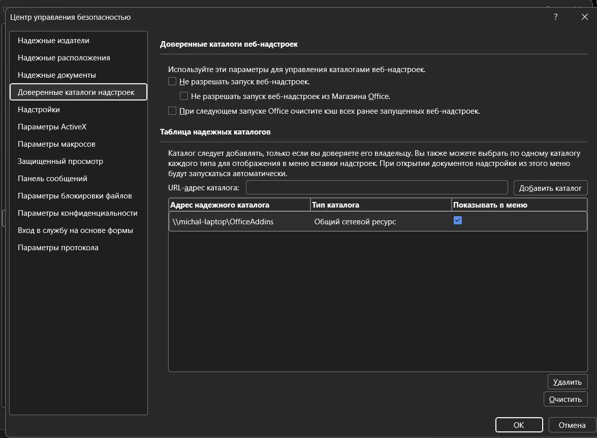
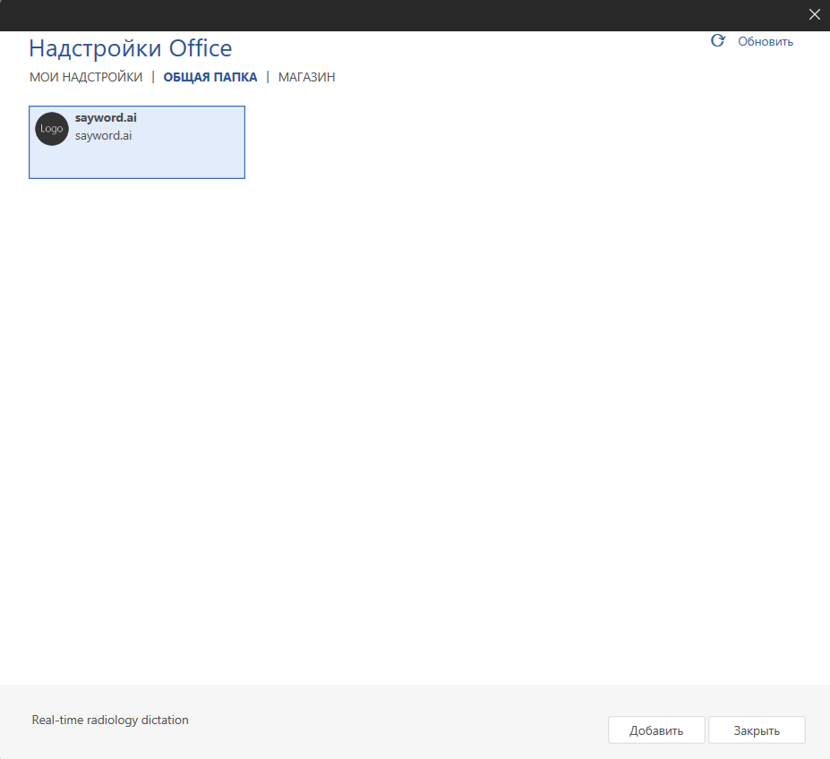

# sayword.ai — Надстройка для Word: установка на Windows

Установка занимает около пяти минут и выполняется один раз — через **доверенную папку**.
Этот способ работает даже если кнопка «Загрузить надстройку» в диалоге недоступна (такое
бывает при корпоративных ограничениях Microsoft 365).

## Установка

#### Шаг 1 — Создайте папку и поместите в неё манифест

1. Создайте папку, например: `C:\OfficeAddins`
2. Скопируйте файл `manifest.prod.xml` из архива в созданную папку.
3. Откройте свойства папки: правой кнопкой мыши → **Свойства** → вкладка
   **Общий доступ** → **Общий доступ…** → нажмите **Общий доступ** (можно оставить
   только себя). Запомните сетевой путь вида `\\ИМЯ_КОМПЬЮТЕРА\OfficeAddins`.

#### Шаг 2 — Добавьте папку в доверенные каталоги Word

1. Откройте Word → **Файл** → **Параметры** → **Центр управления безопасностью** →
   **Параметры центра управления безопасностью…**
2. В левом меню выберите **Доверенные каталоги надстроек**. В поле
   **URL-адрес каталога:** введите сетевой путь из шага 1, например:
   `\\ИМЯ_КОМПЬЮТЕРА\OfficeAddins`

   

3. Нажмите **Добавить каталог**. В таблице появится новая строка — убедитесь, что
   галочка в столбце **Показывать в меню** установлена.
4. Нажмите **ОК** во всех окнах, затем **полностью закройте Word и откройте снова**.

#### Шаг 3 — Активируйте надстройку

1. Перейдите во вкладку **Вставка** → нажмите **Надстройки**. Откроется диалог
   **Надстройки Office**.
2. В верхней части диалога нажмите вкладку **ОБЩАЯ ПАПКА** — там появится карточка
   **sayword.ai**. Выберите её и нажмите **Добавить**.

   

3. На правой панели Word откроется интерфейс sayword.ai. На ленте в группе
   **Commands Group** (крайняя правая вкладка) появится кнопка для повторного
   открытия панели.

Дальше — [первый запуск и вход в аккаунт](2026-07-21-word-addin-installation.md#первый-запуск-и-вход-в-аккаунт).

## Обновление надстройки

Доверенный каталог регистрируется один раз и остаётся в настройках Word — заново
проходить Шаги 1–2 не нужно.

1. Скачайте новую версию `manifest.prod.xml` и замените им старый файл в той же папке
   (например, `C:\OfficeAddins`).
2. **Полностью закройте Word и откройте снова** — Word читает манифест из доверенной
   папки заново при каждом запуске.

Если после этого лента всё ещё показывает старую версию — откройте **Вставка →
Надстройки → ОБЩАЯ ПАПКА** и добавьте карточку **sayword.ai** ещё раз.

## Типичные проблемы

| Проблема | Решение |
|---|---|
| Вкладка «ОБЩАЯ ПАПКА» не появляется в диалоге надстроек | Word не был полностью перезапущен после добавления каталога. Закройте все окна Word, подождите несколько секунд и откройте снова. |
| Надстройка пропала после обновления Word | Доверенный каталог сохраняется, но надстройку нужно добавить заново через **Вставка → Надстройки → ОБЩАЯ ПАПКА**. |
| Кнопка sayword.ai не появилась на ленте | Перезапустите Word после загрузки манифеста — полностью закройте и откройте Word после добавления доверенного каталога. |

Общие проблемы (вход в аккаунт, звук, и т.д.) — см. [основную инструкцию](2026-07-21-word-addin-installation.md#типичные-проблемы).
