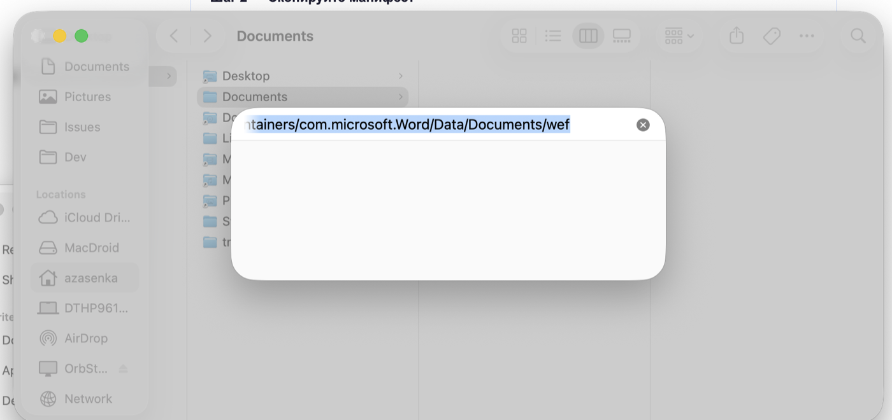
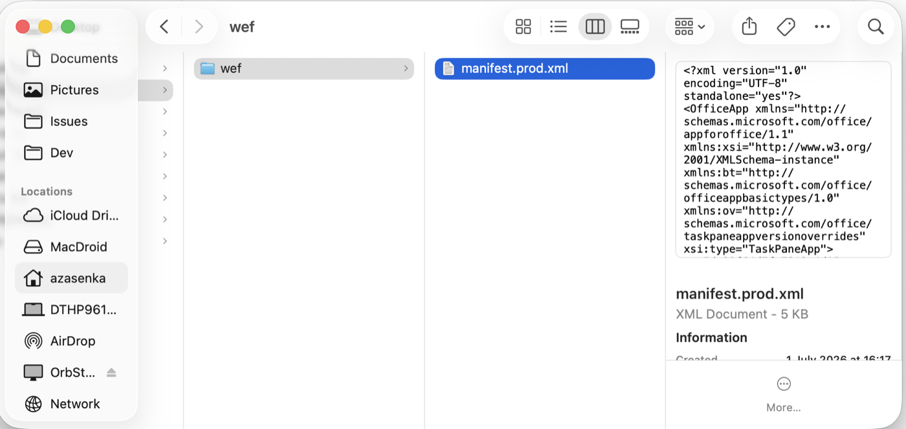
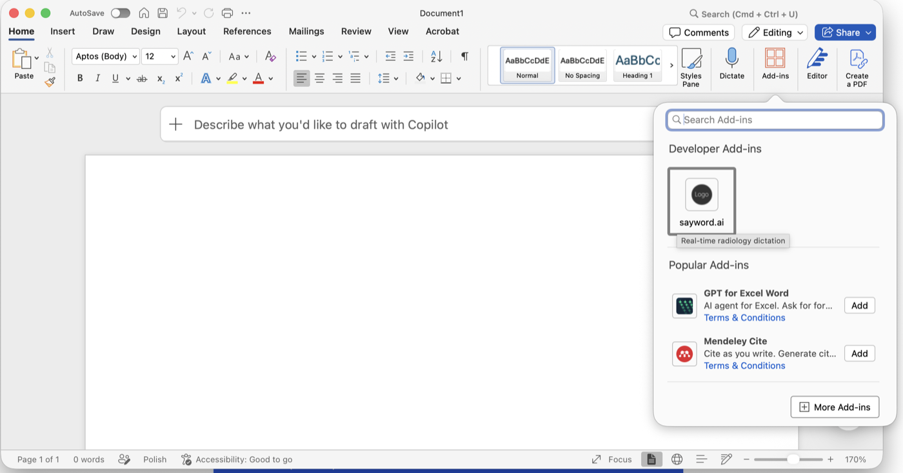
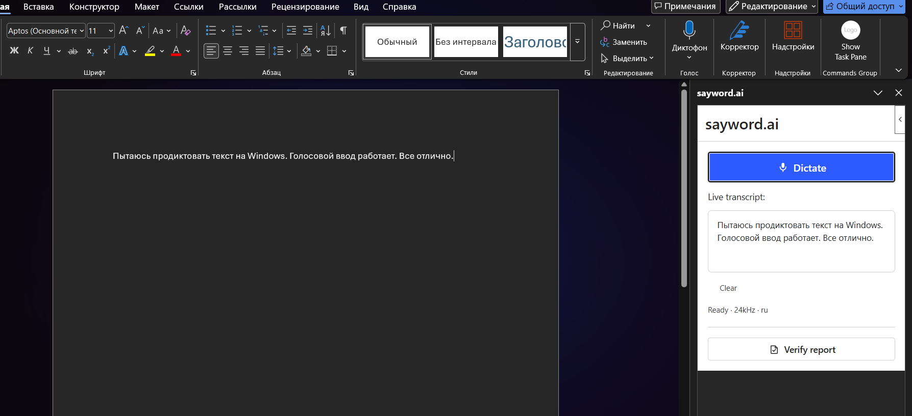
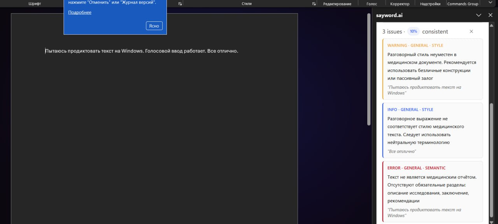

# sayword.ai — Надстройка для Microsoft Word: инструкция по установке

*Версия 1.0 бета*

## О надстройке

**sayword.ai** — надстройка для Microsoft Word, которая добавляет голосовую диктовку
медицинских текстов прямо в документ. Система распознаёт русскую медицинскую терминологию
в режиме реального времени и вставляет текст в позицию курсора. Дополнительно доступна
функция автоматической проверки готового заключения.

!!! info "Бета-версия"
    Вы входите в число первых пользователей. Если что-то работает не так или у вас есть
    пожелания — пишите напрямую: мы отвечаем быстро.

## Требования

| Компонент | Требование |
|---|---|
| Microsoft Word | **Microsoft 365** (подписка) или **Office 2021** (бессрочная лицензия) — десктоп Windows или Mac. На Mac требуется **macOS 11 (Big Sur)** или новее. ⚠ Office 2016 и Office 2019 **не поддерживаются**. |
| Браузер (для Word Online) | Chrome, Edge, Firefox — актуальная версия |
| Аккаунт sayword.ai | Логин и пароль предоставляются отдельно |
| Микрофон | Встроенный или внешний — для функции диктовки |

## Установка надстройки

Надстройка устанавливается через **доверенную папку** — это надёжный способ, который
работает даже если кнопка «Загрузить надстройку» в диалоге недоступна (такое бывает при
корпоративных ограничениях Microsoft 365). Установка занимает около пяти минут и
выполняется один раз.

=== "Windows — Word для рабочего стола"

    #### Шаг 1 — Создайте папку и поместите в неё манифест

    1. Создайте папку, например: `C:\OfficeAddins`
    2. Скопируйте файл `manifest.prod.xml` из этого архива в созданную папку.
    3. Откройте свойства папки: правой кнопкой мыши → **Свойства** → вкладка
       **Общий доступ** → **Общий доступ…** → нажмите **Общий доступ** (можно оставить
       только себя). Запомните сетевой путь вида `\\ИМЯ_КОМПЬЮТЕРА\OfficeAddins`.

    #### Шаг 2 — Добавьте папку в доверенные каталоги Word

    1. Откройте Word → **Файл** → **Параметры** → **Центр управления безопасностью** →
       **Параметры центра управления безопасностью…**
    2. В левом меню выберите **Доверенные каталоги надстроек**. В поле
       **URL-адрес каталога:** введите сетевой путь из шага 1, например:
       `\\ИМЯ_КОМПЬЮТЕРА\OfficeAddins`

       

    3. Нажмите **Добавить каталог**. В таблице появится новая строка — убедитесь, что
       галочка в столбце **Показывать в меню** установлена.
    4. Нажмите **ОК** во всех окнах, затем **полностью закройте Word и откройте снова**.

    #### Шаг 3 — Активируйте надстройку

    1. Перейдите во вкладку **Вставка** → нажмите **Надстройки**. Откроется диалог
       **Надстройки Office**.
    2. В верхней части диалога нажмите вкладку **ОБЩАЯ ПАПКА** — там появится карточка
       **sayword.ai**. Выберите её и нажмите **Добавить**.

       

    3. На правой панели Word откроется интерфейс sayword.ai. На ленте в группе
       **Commands Group** (крайняя правая вкладка) появится кнопка для повторного
       открытия панели.

=== "Mac — Word для рабочего стола"

    #### Способ A (рекомендуется) — установщик в один клик

    Подписанный и заверенный Apple (notarized) установщик сам кладёт манифест в нужную
    папку и перезапускает Word — пароль администратора не требуется.

    1. Скачайте [sayword-addin-macos-v1.1.1.zip](https://github.com/medassistant-net/sayword-word-addin/releases/download/v1.1.1/sayword-addin-macos-v1.1.1.zip)
       и распакуйте архив.
    2. Дважды нажмите на `sayword-installer.pkg` и пройдите шаги **Продолжить →
       Установить**. Установка идёт в вашу пользовательскую папку — пароль
       администратора не требуется.
    3. Установщик автоматически закроет Word. Откройте Word снова и переходите к
       разделу **«Шаг 3 — Активируйте надстройку»** ниже.

    !!! tip "Если macOS предупреждает о неизвестном разработчике"
        Такого быть не должно — установщик подписан и заверен Apple. Но если
        предупреждение всё же появилось, нажмите на файл правой кнопкой мыши →
        **Открыть** → **Открыть**.

    #### Способ B — вручную (если установщик недоступен)

    На Mac нет диалога «Доверенные каталоги надстроек», как в Windows. Вместо этого
    манифест копируется в специальную папку внутри Word — Word подхватывает его
    автоматически.

    #### Шаг 1 — Откройте папку wef

    1. Откройте **Finder** и нажмите `Cmd` + `Shift` + `G` («Переход к папке»).
    2. Введите путь: `~/Library/Containers/com.microsoft.Word/Data/Documents/wef`
       Если папки `wef` нет — создайте её.

       

    #### Шаг 2 — Скопируйте манифест

    1. Скопируйте файл `manifest.prod.xml` из этого архива в папку `wef`.

       

    2. **Полностью перезапустите Word** (Cmd+Q, затем открыть снова) и откройте документ.

    #### Шаг 3 — Активируйте надстройку

    1. На вкладке **Главная** (Home) нажмите **Надстройки** (Add-ins).
    2. В разделе **Developer Add-ins** выберите **sayword.ai**. Панель откроется на
       боковой стороне Word.

       

    !!! warning "Важно для Mac"
        Надстройка не появится, если Word не был полностью перезапущен после копирования
        манифеста (одного закрытия окна недостаточно — нужен Cmd+Q). Если после
        перезапуска надстройка всё ещё не видна или показывает старую версию, закройте
        Word и очистите кэш: удалите содержимое папок
        `~/Library/Containers/com.microsoft.Word/Data/Documents/wef` и
        `~/Library/Containers/com.Microsoft.OsfWebHost/Data/`, затем повторите шаги 1–3.

=== "Word Online (браузер)"

    !!! warning "Примечание"
        Word Online не поддерживает доверенные папки. Для Word Online метод с доверенной
        папкой недоступен — надстройка работает только в десктопном Word (Windows или Mac).

## Первый запуск и вход в аккаунт

1. После добавления надстройки боковая панель **sayword.ai** откроется автоматически.
   В дальнейшем её можно открыть кнопкой в группе **Commands Group** на ленте.
2. Нажмите **Войти**. Откроется окно входа — введите email и пароль от вашего аккаунта
   sayword.ai.
3. После успешного входа панель покажет синюю кнопку **Dictate** и статус
   *Ready · 24kHz · ru*. Если Word запросит доступ к микрофону — нажмите **Разрешить**.

   

## Как пользоваться диктовкой

1. Поставьте курсор в документе туда, куда нужно вставить текст.
2. Нажмите синюю кнопку **Dictate** в панели *или* используйте горячую клавишу:
   `Ctrl` + `Alt` + `D` (только десктоп Word, не Word Online).
3. Говорите в микрофон. Текст в реальном времени отображается в поле **Live transcript**
   и одновременно вставляется в документ.
4. Чтобы остановить, нажмите кнопку **Dictate** ещё раз или снова нажмите
   `Ctrl` + `Alt` + `D`.

!!! tip "Совет"
    Говорите чётко и в обычном темпе. Система оптимизирована для медицинской
    радиологической терминологии на русском языке.

## Проверка готового заключения

1. Когда заключение написано (вручную или продиктовано), нажмите кнопку
   **Verify report** внизу панели sayword.ai.
2. Система проанализирует текст и покажет список замечаний с уровнями: **ERROR**
   (критические ошибки), **WARNING** (предупреждения), **INFO** (стилистические
   рекомендации).

   

3. Нажмите на любое замечание — курсор автоматически переместится к соответствующему
   месту в документе.

## Типичные проблемы

| Проблема | Решение |
|---|---|
| Word показывает ошибку при открытии панели | Убедитесь, что вы подключены к интернету. Если ошибка повторяется — перезапустите Word и попробуйте ещё раз. |
| Кнопка sayword.ai не появилась на ленте | Перезапустите Word после загрузки манифеста. На Windows — полностью закройте и откройте Word после добавления доверенного каталога. На Mac — убедитесь, что манифест лежит именно в папке `wef` (не в «Загрузках» или где-то ещё), и перезапустите Word через Cmd+Q. |
| Диктовка не запускается или нет звука | Проверьте, что браузер (Word Online) или Word (десктоп) получил разрешение на доступ к микрофону в настройках системы. |
| (Windows) Вкладка «Общая папка» не появляется в диалоге надстроек | Word не был полностью перезапущен после добавления каталога. Закройте все окна Word, подождите несколько секунд и откройте снова. |
| (Mac) Надстройка не появляется в Главная → Надстройки | Убедитесь, что манифест лежит в `~/Library/Containers/com.microsoft.Word/Data/Documents/wef`, и что Word был закрыт полностью (Cmd+Q) перед повторным открытием. Если не помогает — очистите кэш (см. раздел Mac выше) и повторите шаги установки. |
| Надстройка пропала после обновления Word | На Windows — доверенный каталог сохраняется, но надстройку нужно добавить заново через Вставка → Надстройки → Общая папка. На Mac — проверьте, что файл манифеста всё ещё в папке `wef` (обновление Word иногда её не трогает, но лишним не будет). |
| Вход не работает, белый экран | Закройте панель, подождите 5 секунд, откройте снова. Если не помогает — напишите нам. |

## Поддержка

По любым вопросам пишите на [saywordai@gmail.com](mailto:saywordai@gmail.com). Мы на
связи и ценим каждый отзыв — вы помогаете сделать продукт лучше.
