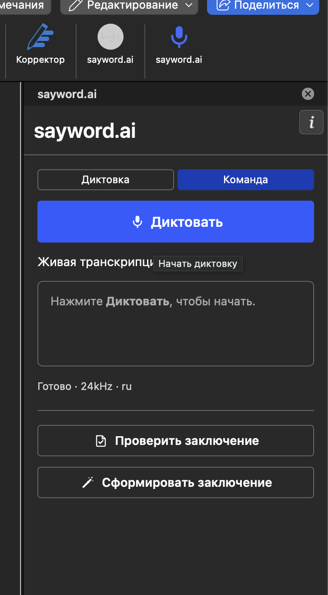
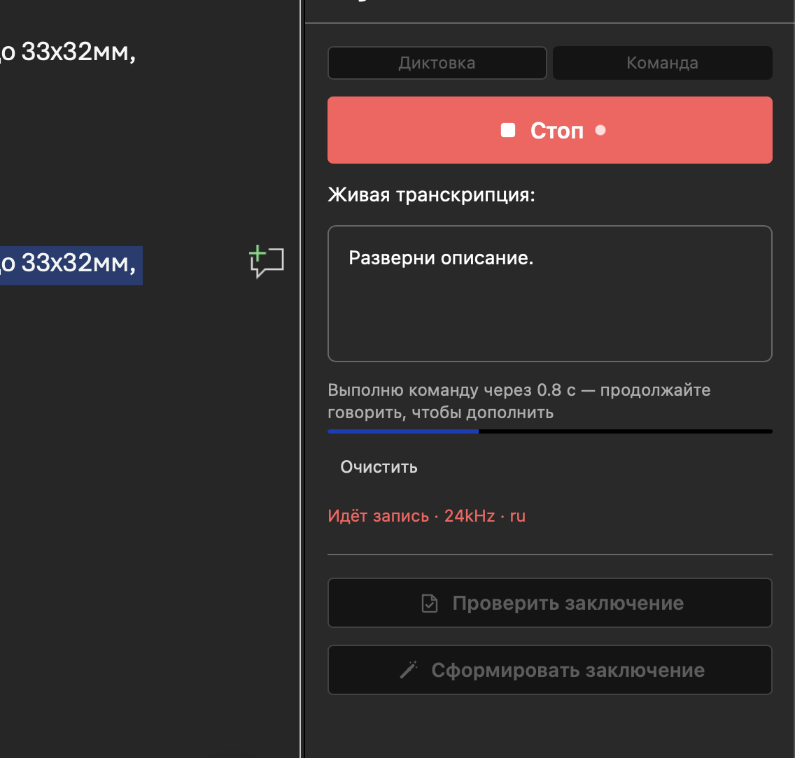
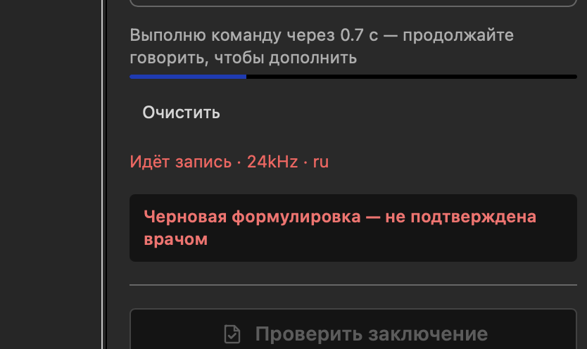
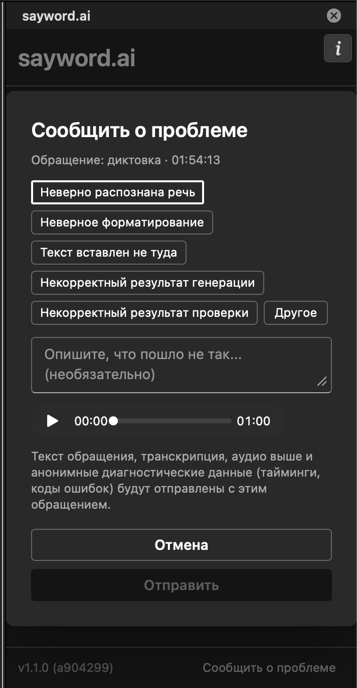

# Command Mode: Your Voice Can Now Edit, Not Just Dictate

**2026-08-29**

!!! warning "Early preview"

    Command mode is open as a preview. It works, but not always: some commands behave
    differently from what is described below, and some come back with an error. We keep it open
    precisely so that you run into that and tell us — real dictated commands show what ours
    never do. The phrasings and the behaviour will change.

    Report a problem with the **Report an issue** button in the task pane, see [the end of the
    article](#if-something-goes-wrong).

The Word add-in has two dictation modes. In **Dictate**, what you say becomes report text. In
**Command**, you say not the text but **what to do with the document** — move a paragraph, cut a
sentence, insert an organ's normal finding — and the document changes on its own.

## Turning it on

Next to the record button there is a switch: **Dictate** and **Command**.

{ .half }

1. Switch to Command **before** you start recording — the switch is locked while recording, so
   it cannot cut off what you have already said.
2. Press record and speak the command in your normal voice.
3. Stop talking. After a couple of seconds the command runs; a countdown on screen says
   "Running the command in N s — keep talking to add to it."

{ .half }

That last point matters more than it looks. The pause is not a patience timer but a way to
extend what you said: while you speak, the countdown resets. Change your mind halfway through —
finish the sentence, and the system hears the whole thing.

If the command is about a specific piece of text, **select it first**. Almost every rule below
rests on the selection.

## What you can say

### Insert an organ's normal finding

> "insert spleen, normal" · "add adrenals, normal" · "write in bronchi, normal"

The most frequent command, and the fastest one: a ready-made wording is inserted, taken from the
corpus of reports — the one that dozens of descriptions agree on almost word for word. Nothing
is composed on the spot, and the answer is immediate.

Say it however it comes out. Russian case endings and the ё/е spelling difference are all
understood the same way. Politeness — "insert the spleen normal here, please" — does not get in
the way.

### Transform the selection

> "format this" · "tidy it up" · "shorten" · "expand" · "rephrase"

A broadly worded request is fine. If your words make it clear what to do, the system does it
rather than asking. "Format this" over a selected paragraph means "bring it to the style
accepted for this area, losing nothing."

### Reorder

> "swap the first and last paragraphs" · "put these in order"

The order changes; the content does not.

### Delete a fragment

> "delete the last sentence" · "drop the bit about the kidneys"

### Fix a fragment

> "correct the previous sentence"

### Change the formatting

> "remove the italics in the first paragraph" · "make this bold"

This is the only case where the system may change markup — when you explicitly ask. Everywhere
else it preserves it.

## CT and MRI: which base of wordings is used

The ready-made wordings live in two separate bases, one for CT and one for MRI. A normal finding
reads differently in each, and substituting one for the other is not acceptable. Which base to
use is decided automatically, in this order:

1. **The modality chosen in settings.** A radiologist usually works one modality, and choosing
   it once is the most reliable option: every command is then unambiguous, including on an empty,
   freshly opened document. A modality selector is coming to the app's settings; until then,
   write to us and we will set it for your connection.
2. **The modality named in the report text.** With nothing set, the system reads the document you
   are working in.
3. **With nothing to go on, the fast substitution does not run** and the command takes the long
   road: slower, but not a guess. That happens on an empty document, or when the text mentions
   both modalities — a comparison with a prior study of the other kind, say. The system will not
   choose in that situation.

## Five rules worth knowing

These are not about the interface but about how the system reasons. Knowing them, you will phrase
commands more precisely — and understand why you sometimes get a question instead of an action.

**1. "The first paragraph" means the first of the selected ones.** Not the first in the
document. You made a selection precisely in order to talk about it. With no selection and a
positional reference, the system asks rather than guessing across the whole document.

**2. The smallest necessary thing is touched.** Ask to delete one sentence inside a selected
paragraph and the sentence goes, rather than the paragraph being rewritten. Rewriting a whole to
fix a part means needlessly running text you did not ask to change through the system. The
smaller the blast radius, the less can go wrong.

**3. Wording changes, content does not.** In any transformation of a selection, every finding,
every organ and every measurement must survive. If the request could only be carried out by
adding or dropping a fact, the system asks. This is its central prohibition.

**4. Markup comes back as it went in.** An organ label that was bold returns bold. Flat text in
answer to marked-up text is the same kind of loss as a dropped measurement, only less immediately
visible.

**5. One command, one undo.** Ctrl+Z returns the document to its state before the command, in
full. And it does not swallow what you typed beforehand.

## What command mode cannot do yet

Better to read this now than to conclude something is broken later. The list of known limits is
not the list of all of them: the mode is a preview, and some of its defects we find together
with you.

- **For seven organs the normal-finding insertion is switched off on purpose.** The data
  labelling for them in the corpus is wrong, and instead of a plausible-looking wrong paragraph
  the system explains what the problem is. "Insert liver, normal" answers with a refusal and an
  explanation rather than pasting someone else's text. This gets fixed on the corpus side, not
  in the app.
- **A repeated fragment is refused.** If what you ask to delete or fix occurs twice in the
  document ("not enlarged", "unremarkable"), the system will not guess which one. Select the
  right spot and repeat.
- **A positional reference with no selection gets a question.** See rule 1.
- **Two requests in one utterance** ("add spleen normal and format the rest") are both carried
  out, but more slowly: the fast substitution is not built for that, and the whole utterance
  takes the long road.
- **The web editor and the desktop app are coming.** In the desktop app command mode will be
  insert-only: by design it does not read the document you are working in, and that constraint
  stays.

## What it rests on

Three things explain almost all of command mode's behaviour.

**The wordings live in a corpus of reports, not inside the program.** That is why they are shared
across all our applications and can be extended without updating the add-in: as the corpus grows,
"insert <organ>, normal" starts answering where there was nothing to answer with. Today 80
area-and-organ combinations out of 120 are covered in the CT base, and 62 out of 75 in the MRI
base.

**Inserting a normal finding is substitution, not composition.** The ready text is taken from the
corpus as it stands, which is why it arrives instantly. Everything else — transformations,
deletions, reordering — requires understanding the utterance and takes a few seconds.

**A refusal beats a silent mistake.** A command it cannot resolve is not guessed at: the system
asks, and says what exactly is unclear. You see a refusal immediately; a quietly mangled
paragraph you find a week later.

## About the "provisional wording" badge

When inserted text comes from the corpus, a badge appears in the task pane: **provisional
wording, not confirmed by a radiologist**. The corpus was selected automatically, and no
anatomical area has been signed off by a doctor yet.

{ .half } As doctors work through the base, the badge will disappear area
by area — with no app update.

And the rule that changes neither with the mode nor with the version: **responsibility for the
content of the report stays with the doctor.** The system prepares the text; the doctor signs
it.

## If something goes wrong

The task pane has a **Report an issue** button — use it rather than your memory: pressed right
after a command that misfired, it attaches the recognised fragment and the last minute of audio,
so we can see what you actually said.

{ .half }

One thing it needs from you. What gets attached is what you **said**, not what the system did
with it — the dialog header will say the report is about dictation even when you are reporting a
command that misfired. So add a line in the comment field about what you expected and what happened: "expected
the last sentence to be deleted — the whole paragraph was rewritten." Two lines are enough, and
they are what turns a report into a fixable defect.

A command that was refused where it should have worked is the most useful thing you can send us.
If email is easier: [saywordai@gmail.com](mailto:saywordai@gmail.com).
